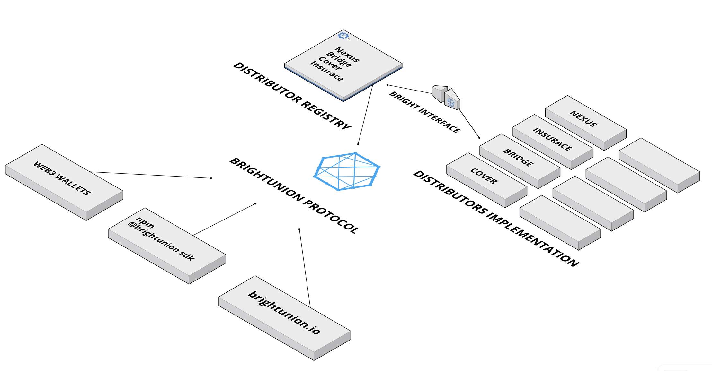

# Distributors-docs
An api express server for interactive swagger documentation on the BrightUnion protocol.

    - Demo : [api.brightunion.io/protocol/api-docs](http://api.brightunion.io/protocol/api-docs) 

# Bright Union: Distributors

The BrightUnion protocol is a set of solidity contracts that offer easy integration of insurance coverage services from multiple risk platforms in a single stop.

The protocol implements an independent aggregator pattern that allows for seamless onboarding of any new risk platform on a multi-block-chain approach over a hybrid mix of on and off-chain interactions.

- Risk platforms currently supported:
    - Insurace 
    - DeFiNexus 
    - MutualBridge Mutual

- The protocol is available to interact with blockchain services on the following  networks and it's respective testing environments:
    - Ethereum main network
    - Binance Smart Chain
    - Polygon

## Contract components
 
<ol>
<li> <strong><em>Distributor registry</em></strong></br>
Storage contract to keep record & control of all distributors contract addresses.
</li>


<li> <strong><em>Aggregator contract</em></strong></br>
Independent contract that will read & execute based on available distributor registry.
</li> 

<li> <strong><em>BrightUnion service interface</em></strong></br>
Service signature to implement for any new distributor.
</li> 
 
<li> <strong><em>Distributor service</em></strong></br>
 Implementation OR service implementation wrapper contract </br>
(Nexus NFT wrapper).
</li> 
 
<li> <strong><em>Upgradable proxies</em></strong></br>
Upgrade Proxies from from all contract components.
</li> 

</ol>





# Contract Members - constants & variables

```js
DistributorRegistry public registry;
bytes4 private constant IID_IDISTIBUTOR = type(IDistributor).interfaceId;

```

# Modifiers

```js
modifier supportsIDistributor(string memory _distributorName)
```
***Require***

Requires distributor address to implement the IDistributor interface, the "Bright Interface".

# Functions

- [_getDistributorAddress](#_getDistributorAddress)
- [_getCoversCount](#_getCoversCount)
- [_getCovers](#_getCovers)
- [_getQuote](#_getQuote)
- [_buyCover ](#_buyCover)

- [_buyCoverDecode](#_buyCoverDecode)


## _getDistributorAddress

```js
function _getDistributorAddress(string memory  _distributorName) 
         public view
         supportsIDistributor(_distributorName) 
         returns(address)
```

**Returns**

The address for specified Distributor Name.

**Arguments**

| Name        | Type           | Description  |
| ------------- |------------- | -----|
| _distributorName | string | Name of distributor in lower case. ex: nexus, bridge, insurace etc... | 

**Example**
```js
 function _getDistributorAddress('insurace')
```

## _getCoversCount

```js
 function _getCoversCount(string memory _distributorName,
                         address _owner, 
                         bool _isActive)
                         public view 
                         supportsIDistributor(_distributorName) 
                         returns(uint256)
```

**Returns**

Returns the cover count owned by spec address

**Arguments**

| Name        | Type           | Description  |
| ------------- |------------- | -----|
| _distributorName | string | Name of distributor in lower case. ex: nexus, bridge, insurace etc... | 
| _owner | address | owner's address of the user who owns the coverage  |
| _isActive | boolean | true/false value for active or inactive cover status | 

**Example**
```js
 function _getCoversCount('nexus',0x78766c9Dc71f1278Cd04CeDA6DA1Ebab4838353d,true)
```


## _getCovers

```js
 function getCovers(
        string memory _distributorName,
        address _owner,
        bool _isActive,
        uint256 _limitLoop
        ) public supportsIDistributor(_distributorName)
          view returns (IDistributor.Cover[] memory)
```

**Returns**

Array of Cover struct from owner's address of specified distributor.
```js
struct Cover {
        bytes32 coverType;
        uint256 productId;
        bytes32 contractName;
        uint256 coverAmount;
        uint256 premium;
        address currency;
        address contractAddress;
        uint256 expiration;
        uint256 status;
        address refAddress;
    }
```

**Arguments**

| Name        | Type           | Description  |
| ------------- |------------- | -----|
| _distributorName | string | Name of distributor in lower case. ex: nexus, bridge, insurace etc... | 
| _owner | address |  address of the user who owns the coverage  |
| _isActive | boolean | true/false value for active or inactive cover status | 

**Example**
```js
 function _getCoversCount('nexus',0x78766c9Dc71f1278Cd04CeDA6DA1Ebab4838353d,true)
```


## _getQuote

NOTE: Required parameters will be different based on the Distributor intended to call, please refer the arguments section of the function for each list of necessary parameters. Values not required are need to be filled by any arbitrary value of its data type like the "_interfaceCompliant1" bellow. This values wont be used but are necessary for the function execution & the Bright interface compliance.

Function currently supported for Bridge and Nexus Distributor.

```js
  function getQuote(
        string memory _distributorName,
        uint256 _interfaceCompliant1,
        uint256 _interfaceCompliant2,
        uint256 _sumAssured,
        uint256 _coverPeriod,
        address _contractAddress,
        address _coverAsset,
        address _coverable,
        bytes calldata _data)
        public supportsIDistributor(_distributorName) 
        view returns(
                IDistributor.CoverQuote memory
            )
```

**Returns**

CoverQuote struct prodId/coverId of specified distributor.
```js
struct CoverQuote {
        uint256 _sumAssured;
        uint256 _coverPeriod;
        uint256 _contractAddress;
        uint256 _coverAsset;
        uint256 _amountInWei;
        uint256 _epochs;
        uint256 _prodAddress;
    }
```

**Arguments** 
<br> 

NEXUS
| Name        | Type           | Description  |
| ------------- |------------- | -----|
| _distributorName | string | Name of distributor in lower case. ex: nexus, bridge, insurace etc... | 
| _interfaceCompliant1 | uint256 | Arbitrary value type uint256 |
| _interfaceCompliant2 | uint256 | Arbitrary value type uint256 |
| _sumAssured | uint256 | The total sum to cover  |
| _coverPeriod | uint256 | The duration of the cover in days |
| _contractAddress | address | Address of the Nexus cover contract |
| _coverAsset | address | The currency to cover with|
| _nexusCoverable | address | Address of nexus product  |
| _data | bytes calldata |encoded data params  |

<br>

BRIDGE
| Name        | Type           | Description  |
| ------------- |------------- | -----|
| _distributorName | string | Name of distributor in lower case. ex: nexus, bridge, insurace etc... | 
| _interfaceCompliant1 | uint256 |  Arbitrary value type uint256  |
| _interfaceCompliant2 | uint256 | Arbitrary value type uint256   |
| _bridgeEpochs | uint256 | Bridge policy epoch |
| _amountInWei | uint256 | Bridge policy price in wei |
| _interfaceCompliant3 | address |  Arbitrary value type address |
| _bridgeProductAddress | address |Bridge product address|
| _interfaceCompliant4 | address | Arbitrary value type address  |

**Example**
```js
   function getQuote(
                'nexus',
                0,
                0,
                100000000,
                180,
                0x71D6a3a982551dC10615ba9fFFbD3c050,
                0xEeeeeEeeeEeEeeEeEeEeeEEEeeeeEeeeeeeeEEeE,
                0x79D6a3a2eC51dC104615ba9fFFbD3c050,
                data // web3.eth.encode(data))
              )
```


## _buyCover

NOTE: Required parameters will be different based on the Distributor intended to call, please refer the arguments section of the function for each list of necessary parameters. Values not required are need to be filled by any arbitrary value of its data type like the "_interfaceCompliant1" bellow. This values wont be used but are necessary for the function execution & the Bright interface compliance.

Function currently supported to buy from Bridge and Nexus
```js
   function buyCover(
        string memory _distributorName,
        address _contractAddress,
        address _coverAsset,
        uint256 _sumAssured,
        uint16 _coverPeriod,
        uint8 _coverType,
        uint256 _maxPriceWithFee,
        bytes calldata _data
    ) public supportsIDistributor(_distributorName) payable 
```

**Returns**

Buy cover transaction receipt

**Arguments** 

| Name        | Type           | Description  |
| ------------- |------------- | -----|
| _distributorName | string | Name of distributor in lower case. ex: nexus, bridge, insurace etc... | 
| _contractAddress | address |  over's reference or contract address |
| _coverAsset | address |  Asset address of currency to pay with |
| _sumAssured | uint256 | Total Sum covered  |
| _coverPeriod | uint16 | Covered period of the risk coverage  |
| _coverType | uint8 |  Cover's specific protocol type |
| _maxPriceWithFee | uint256 | Cover's total premium  |
| _data |  bytes calldata |Encoded data 

**Example**
```js
   function buyCover(
                'bridge',
                0x71D6a3a982551dC10615ba9fFFbD3c050,
                0xEeeeeEeeeEeEeeEeEeEeeEEEeeeeEeeeeeeeEEeE,
                100000000,
                180,
                1,
                180000000000,
                data // web3.eth.encode(data))
              )
```


## _buyCoverDecode

NOTE: Only Insurace -  Required parameters will be different based on the Distributor intended to call, please refer the arguments section of the function for each list of necessary parameters. Values not required are need to be filled by any arbitrary value of its data type like the "_interfaceCompliant1" bellow. This values wont be used but are necessary for the function execution & the Bright interface compliance.

Function currently supported to buy from Insurace
```js
    function buyCoverDecode(
        string memory _distributorName,
        uint16[] memory _products,
        uint16[] memory _durationInDays,
        uint256[] memory _amounts,
        address _currency,
        uint256 _premiumAmount,
        uint256[] memory _helperParameters,
        uint256[] memory _securityParameters,
        uint8[] memory _v,
        bytes32[] memory _r,
        bytes32[] memory _s
    ) public supportsIDistributor(_distributorName) payable 
```

**Returns**

Buy cover transaction receipt

**Arguments** 

| Name        | Type           | Description  |
| ------------- |------------- | -----|
| _distributorName |    string memory |  string name of the protocol/distributor to buy from|
| _products |           uint16[] |  Array Product Ids of covers  |
| _durationInDays |     uint16[] | Array Cover periods   |
| _amounts |            uint256[] | Array Covered sum amounts  |
| _currency |           address  |address of the asset to pay with  |
| _premiumAmount |      uint256  | Cover total price in wei |
| _helperParameters |   uint256[]   | Array security params provided by confirmCover Insurace http api call  |
| _securityParameters | uint256[]   | Array security params provided by confirmCover Insurace http api call   |
| _v |                  uint8[]     | ECDSA signature msg param  |
| _r |                  bytes32[]   | ECDSA signature msg param  |
| _s |                   bytes32[]  | ECDSA signature msg param  |

**Example**
```js
   function buyCover(
                'insurace',
                [0x71D6a3a982551dC10615ba9fFFbD3c050],
                [180],
                [100000000],
                [0xEeeeeEeeeEeEeeEeEeEeeEEEeeeeEeeeeeeeEEeE],
                [200000000000],
                [34],
                [34],
                [_v],
                [_r],
                [_s],
              )
````


# Testnet examples
### Kovan
- [Nexus Implementation contract](https://kovan.etherscan.io/address/0x761fc75a7b9746fdad8470dacb36ea9dc6463264#code)
    - Proxy : ```0x532340203e59074bdb92cAF5f93bFfCfc8bC0F06```
    - Implementation: ```0x761fc75a7b9746fdad8470dacb36ea9dc6463264```

- [Distributor Registry contract](https://kovan.etherscan.io/address/0x91B8b5501b38943C09EAD48406daa1D9445fE782#code)
    - Proxy: ```0x6F7F00699ecE297e6FAbd136e1dfd1A371742352 ```
    - Implementation: ```0x91B8b5501b38943C09EAD48406daa1D9445fE782```
- [Main Distributor Contract (aggregator)](https://kovan.etherscan.io/address/0x7C4661aFceB003aDcD126c7f3A1eBD29962BC01D#code)
    - Proxy: ```  0x75D6a3a2eC3593982551dC10615ba9fFFbD3c050  ```
    - Implementation: ``` 0x7C4661aFceB003aDcD126c7f3A1eBD29962BC01D ```


